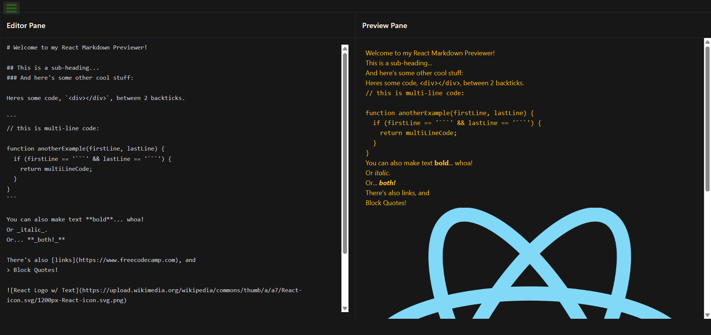

# React Markdown Previewer

A simple and powerful real-time Markdown previewer built with React. Write your Markdown in the editor on the left and see the rendered HTML on the right instantly.

## Features

- **Live Preview**: See your Markdown rendered in real-time as you type in a convenient two-column layout.
- **GitHub Flavored Markdown (GFM)**: Full support for GFM features thanks to [`remark-gfm`](https://github.com/remarkjs/remark-gfm). This includes:
  - Tables
  - Strikethrough (`~~text~~`)
  - Task lists (`- [x] task`)
  - Autolinks (`www.example.com`)
  - Footnotes (`[^1]`)
- **Intuitive Line Breaks**: Newlines in your editor are rendered as hard breaks (` `), making it easy to format text without needing to add two spaces at the end of a line. This is enabled by `remark-breaks`.
- **Safe by Default**: Renders Markdown to React components without using `dangerouslySetInnerHTML`, protecting against XSS attacks.

## Tech Stack

This project is built using modern web technologies:

- **React**: A JavaScript library for building user interfaces.
- **react-markdown**: A React component to render Markdown. It's safe and allows for deep customization via plugins and custom components.
- **remark-gfm**: A remark plugin to add support for GFM (tables, strikethrough, task lists, and autolinks).
- **remark-breaks**: A remark plugin to support breaks without needing two spaces.

## License

Distributed under the MIT License. See `LICENSE` for more information.
